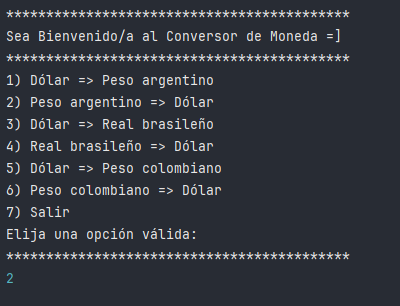

# Challenge: Conversor de Monedas
Creación de un conversor de tipo de cambio para diferentes monedas desarrolado en el lenguaje Java y por medio de una API que nos ayuda a obtener las tiferentes tasas de cambio

## Estudiante: Eduardo Chero

## Características principales:
Conversión entre múltiples monedas:
- Dólar (USD) ⇔ Peso Argentino (ARS)
- Dólar (USD) ⇔ Real Brasileño (BRL)
- Dólar (USD) ⇔ Peso Colombiano (COP)
- Obtención automática de tasas de cambio desde ExchangeRate API.
- Menú interactivo en consola para seleccionar las opciones de conversión.

Se construlleron las solucitudes Http para el manejo y uso de la API implementada.
```java
URI direccion = URI.create(URL);
HttpClient client = HttpClient.newHttpClient();
HttpRequest request = HttpRequest.newBuilder().uri(direccion).build();
```
Mediante el uso de Gson podemos modelar la data que se obtiene en un formato JSON y usamos try catch para detectar algunos poblemas por medio de Exception
```java
try {
    HttpResponse<String> response = client.send(request, HttpResponse.BodyHandlers.ofString());
    return new Gson().fromJson(response.body(), TipoCambio.class);
} catch (Exception e) {
    throw new RuntimeException("No se pudo obtener el tipo de cambio. Detalles: " + e.getMessage());
}
```

## Uso
- El usuario accede al menu y puede elgir las diferentes opciones

- Luego ingresa el valor que desea convertir y se mostrará cuando es su equivalencia
